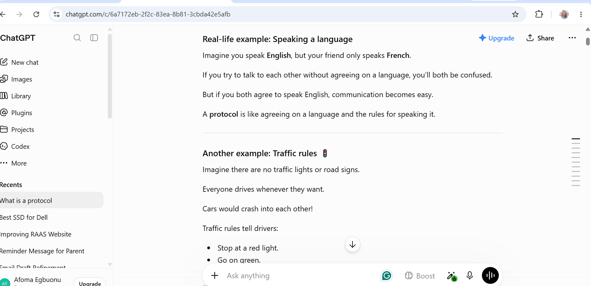

# Week 00 - Internet and Networking

Part of the DevOps Micro Internship (DMI) Cohort 3 with Agentic AI

---

# 🧑‍💻 Task 1: Using ChatGPT as Your Learning Assistant

## Scenario

You're new to DevOps and will frequently encounter technical questions. ChatGPT can be your learning companion.

## Your Task

Write a clear ChatGPT prompt to help you understand:

> "What is a protocol in networking? Explain with a simple real-life example."

Take a screenshot of your interaction showing:

* Your detailed prompt (with clear expectations)
* ChatGPT's simplified response with an example

## Screenshot

Save your screenshot in the `screenshots` folder and update the file name below.

  )


Replace `task-1-chatgpt.png` with your actual screenshot file name.

---

## What I Learned (2–3 lines)

I learned that protocol is a set of rules that allows computers to communicate with each other correctly, just like people need a common language and traffic needs road rules.

---

# 🌐 Task 2: Internet and Networking

## Scenario

Your friend is launching an online bookstore named **EpicReads**.

He asked you to explain how users globally can access his website hosted in Finland.

## Your Task

Write a short explanation (**100–150 words**) that includes:

* Packet Switching
* IP Address
* TCP/IP
* HTTP/HTTPS

💡 **Tip:** You may use ChatGPT (as demonstrated in Task 1) to refine your explanation.

## Answer

EpicReads is hosted on a server in Finland, but anyone in the USA can access it through the internet. When a user enters the website address in a browser, the browser uses the website's IP address to locate the correct server where the website is hosted. It then uses TCP/IP, which is a set of communication rules, to establish a reliable connection and make sure the data is delivered correctly and in the right order. Next, my browser sends an HTTP or HTTPS request to ask the server for the webpage. HTTP is the protocol used to request and receive web pages, while HTTPS is the secure version that encrypts the data during transmission. The server sends the webpage back in small pieces called packets through packet switching. These packets may travel along different routes across the internet before my computer reassembles them to display the complete EpicReads website using TCP.


---

# 🏗️ Task 3: Application Architecture & Stack

## Scenario

EpicReads bookstore has two application versions:

### Two-Tier Application

* Frontend
* Database

### Three-Tier Application

* Frontend
* Backend
* Database

## Your Task

* Draw simple diagrams (hand-drawn or tool-based such as draw.io)
* Label each layer clearly
* List at least two common technologies or tools used for each layer
* Submit a screenshot or photo clearly showing your own drawing

## Diagram Screenshot / Photo

Save your diagram image in the `screenshots` folder and update the file name below.

](image-2.png))


Replace `task-3-diagram.png` with your actual diagram file name.

---

## Technologies Used

### Frontend

* HTML
* REACT

### Backend

* PYTHON
* Node.js

### Database

* MYSQL
* postgreSQL

---

# 🌍 Task 4: Domain Name & DNS (Basic Concepts)

## Scenario

Your friend's bookstore **EpicReads** is currently accessible through:

```text
52.172.142.222:3000
```

He purchased the domain:

```text
epicreads.com
```

## Your Task

In **50–100 words**, explain in your own words:

1. What is DNS (Domain Name System)?
2. Which DNS record type should be used to connect the domain to the given IP, and why?

## Answer

DNS (Domain Name System) is like the internet's address book. It translates a domain name, such as epicreads.com, into an IP address that computers use to find the correct server. Without DNS, users would have to remember long IP addresses instead of simple website names. Since 52.172.142.222 is an IPv4 address, my friend should use an A Record. An A Record links the domain name to the IPv4 address, allowing users to access the EpicReads website by typing epicreads.com into their browser.
---

# 💻 Task 5: Visual Studio Code Setup (Hands-on)

## Your Task

Install Visual Studio Code (if not already installed).

Take a screenshot of your VS Code environment showing:

* Terminal open inside VS Code
* Running a basic command:

### Windows

```powershell
dir
```

### Linux / macOS

```bash
pwd
ls
```

* Your selected VS Code theme clearly visible

⚠️ **Important:** The screenshot must show your username or another identifiable detail to confirm it is your environment.

## Screenshot

Save your screenshot in the `screenshots` folder and update the file name below.

)


Replace `task-5-vscode.png` with your actual screenshot file name.

---

# 🔗 Task 6: Publish Your Assignment as a LinkedIn Post

## Objective

Publishing on LinkedIn helps you:

* Build your professional online presence
* Reinforce your learning
* Document your DevOps journey publicly

## Your Task

Summarize your answers from Tasks 1–5 into a LinkedIn post.

Clearly structure your post into the following sections:

* ChatGPT
* Internet & Networking
* App Architecture
* DNS
* VS Code Setup

Add the following credit note at the end of your post:

> **P.S. This post is part of the DevOps Micro Internship (DMI) with Agentic AI — Cohort 3 — by Pravin Mishra. My graded progress is public: https://dmi.pravinmishra.com/s/YOUR-GITHUB-USERNAME.html · Start your DevOps journey: https://dmi.pravinmishra.com/?utm_source=student&utm_medium=ps-linkedin&utm_campaign=cohort3**

---

## LinkedIn Post URL

Paste your LinkedIn post URL here:

```text
https://www.linkedin.com/posts/afoma-egbuonu-a0304a43_dmibypravinmishra-ugcPost-7490620685745033216-HJVX/?utm_source=share&utm_medium=member_desktop&rcm=ACoAAAkVPSMBE3v_GANgv4HimZVdVa0QnO8iL9I
```

---

## LinkedIn Post Backup Copy

Paste the full text of your LinkedIn post here:

Restarting My DevOps Journey with a Stronger Foundation


I'm excited to be going through the DevOps Micro Internship (DMI) again but this time through the Self-Paced Engineer Track.

I previously completed this program, but I've decided to revisit it from the beginning to refresh my knowledge, strengthen my understanding of the fundamentals, and fill in any gaps as I continue growing in my DevOps career. This second pass allows me to learn at my own pace while reinforcing the concepts through hands-on practice.

I'm excited to share that I've completed my first assignment in my DevOps learning journey. Although I'm just getting started, this week helped me build a strong foundation in networking, application architecture, DNS, and developer tools.

ChatGPT became My Learning Assistant

I used ChatGPT to better understand networking protocols through simple, beginner-friendly explanations and real-life examples.


 Internet & Networking

I learned how users can access a website hosted in another country and deepened my understanding of packet switching, IP addresses, TCP/IP, and HTTP/HTTPS.

 Application Architecture

I compared two-tier and three-tier application architectures and explored how the frontend, backend, and database work together, along with common technologies used in each layer.

Domain Name System (DNS)

I reviewed how DNS translates domain names into IP addresses and learned why an A Record is used to map a domain to an IPv4 address.


Revisiting the fundamentals has reminded me that building a strong foundation is just as important as learning advanced tools. I'm looking forward to continuing this journey and sharing more of what I learn.


P.S. This post is part of the DevOps Micro Internship (DMI) — Self-Paced Engineer Track — by Pravin Mishra. My graded progress is public: https://dmi.pravinmishra.com/s/AfomaCloud21.html · Start your DevOps journey: https://dmi.pravinmishra.com/?utm_source=student&utm_medium=ps-linkedin&utm_campaign=self-paced #DMIByPravinMishra

---

# Reflection – Week 0

### What did you find easy?

Since I have a prior knowledge, I found it quite easy.

---

### What was difficult?

Nothing

---

### What will you improve next week?

Nothing yet

---

## 📌 About DMI & CloudAdvisory

DevOps Micro Internship (DMI) is a project-based DevOps program run by Pravin Mishra (The CloudAdvisory) focused on real-world execution, systems thinking, and career readiness.

It helps learners build strong DevOps foundations with hands-on experience.


## 📌 Resources

- 🌐 **DMI Official Website:** https://dmi.pravinmishra.com?utm_source=github&utm_medium=readme  
- 🎓 **University:** https://university.pravinmishra.com?utm_source=github&utm_medium=readme  
- 💬 **Discord Community:** https://discord.pravinmishra.com?utm_source=github&utm_medium=readme  
- 📝 **Blog:** https://dmi.pravinmishra.com/blog?utm_source=github&utm_medium=readme  
- ▶️ **YouTube Playlist (DMI Cohort 3):** https://www.youtube.com/playlist?list=PLFeSNDtI4Cho  
- 🔗 **Pravin Mishra (LinkedIn):** https://www.linkedin.com/in/pravin-mishra-aws-trainer/  
- 🏢 **CloudAdvisory (LinkedIn):** https://www.linkedin.com/company/thecloudadvisory/

---

*This submission is part of DevOps Micro Internship (DMI) Cohort 3 — Agentic AI Track*